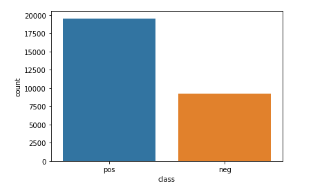
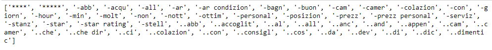
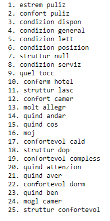
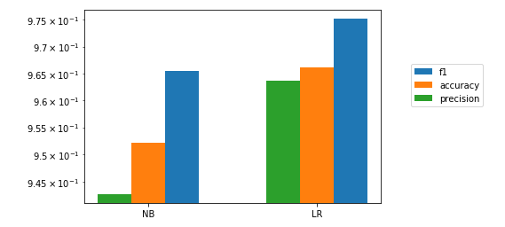
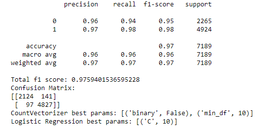
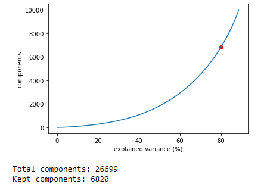

#Data Science Lab: Process and methods
##Politecnico di Torino
###Exam session: Winter 2020

##1. Data exploration
I first understand the structure of my dataset: it is in a csv format, so I encapsulate
all data inside a data frame.
It’s easy to observe that each review has been labeled with just one class chosen
between positive and negative, hence we can plot how they are distributed in terms of
proportions.

They are very unbalanced, the positive class is approximately doubled with
respect to the negative one, this could turn into a higher misprediction ratio for the
latter.

Then I focus on the text of the reviews, trying to find out what kind of
transformations are needed during the pre-processing step.
I use a cyclic approach in order to discover as many inappropriate words as possible:
* I build a set of all the unique words in the reviews.
* I sample a portion of these set and I analyze those words observing if there are
some kind of tokenization error, words containing special characters or
numbers, URLs or something that could be meaningless for the analysis.
* I add more filter or text transformation in order to obtain the cleanest data as
possible.

## 2. Preprocessing
Our purpose is to obtain numerical features having meaning for the analysis, so we
need to select the most significant words and then transform each of them into a
numerical representation.
For each review I apply a series of text transformation: firstly I convert everything into
lower case letters, then, if present, I remove URLs or email or specific combination of
possible special characters followed by words (i.e @<word>, #<word>). In the end, when
there are punctuation marks, numbers or special characters followed or preceded by a
word, I substitute them for a blank character (i.e “l’hotel” becomes “l hotel”) aiming to
guarantee a correct tokenization.
When the cleaning process is over, tokenization starts. I decide to stem every word in
order to better group every shade of a specific "word-root", using ItalianStemmer()
class from nltk library.
Finally, the tokens are filtered so, stop-words, punctuation marks, numbers, words of
inappropriate length are removed.
The only words left are the ones with a potential meaning for the analysis, so
now we can use a CountVectorizer() to convert every word into a number that
represents its frequency among reviews.
But in this way, one problem shows up: we are only counting how many times a word
appears in the set of reviews, which results in biasing in favour of most frequent words.
So, it ignores rare words, which could have been helpful to label a review. To overcome
this problem, we can apply a Tf-Idf Transformation on the output of the
CountVectorizer. Tf-Idf balances the term frequency in the single review with its inverse
frequency across all reviews. This means that rarer word will have more importance
when it's needed to take decisions in sentiment analysis.
As a final step during vectorization, I consider n-grams of length two in addition
to one-grams. There are many words that may have poor meaning or may be
ambiguous, in this context, if considered isolated, but at the same time may be the best
factor to analyse, in order to label a review as positive or negative, when it is included
in a two-gram. For example, if we consider the word “vacanza” by itself, we can’t say for
sure if the review is positive or negative; on the other hand, a two-gram such as “ottima
vacanza” is probably inside positive one.

##3. Algorithm choice
Considering the goal of this data science task, we can observe that we have a binary
classification problem and a huge quantity of features (the total number of distinct word
that we have found during the pre-process step) to deal with: my choice fell on logistic
regression.
Contrary to what might be thought, logistic regression is mostly used as a binary
classification algorithm thanks to its characteristic to map each value in input to '0' or
'1'.
Having this great amount of features leads to think that there are dependencies
among them: in this circumstance, probably, some words are correlated with others.
Using a different classification algorithm such as Naïve Bayes, this situation could turn
into a poorer prediction due to the intrinsic assumption of this algorithm that is to
consider each feature as conditionally independent. On the contrary the presence of this
correlation among the words may be negligible using logistic regression because it just
tries to split the feature space as good as possible in a linear way.
Finally, it handles very well either categorical or continuous features, so it fit perfectly
with this case.
Concerning the implementation, logistic regression doesn’t require too many
combinations of hyper-parameter during the tuning step and it is a very easy-to-use and
efficient solution in terms of time consumption and prediction rate.
I would like to show a comparison diagram to support the choice I have made

##4. Tuning and validation
Before start training the model, I split the development dataset into train and test
set with respectively 75% and 25% proportions. Then I build a parameter grid for
CountVectorizer and the logistic regression model. I use a brute force approach and
every combination of these (hyper)parameters is employed to build pipelines in order
to specify every step starting from raw data to the best estimator. During the tuning, my
pipeline has three steps: vectorization through CountVectorizer, Tf-Idf transformation
and the training of the model as I explained before.
As the dataset is quite big, it is reasonable to think that the initial split is already enough
to avoid overfitting, in fact, I avoid using k-fold cross validation in this case: as a result,
the tuning process is faster.
Once every pipeline has been fitted, I validate all the results using the "f1-score" metric
and I pick the pipeline that reaches the highest score.

At this point the tuning step is over and the best pipeline can be used to train the
final model using 100% of the initial dataset. Before starting to fit, I change the pipeline
steps: after the tfidf transformation, I insert a TruncatedSVD step in order to reduce the
huge feature space dimensionality, trying to keep a number of components that covers
around 80% of the explained variance: this guarantees a good balance between
computational time and accuracy of the model.

